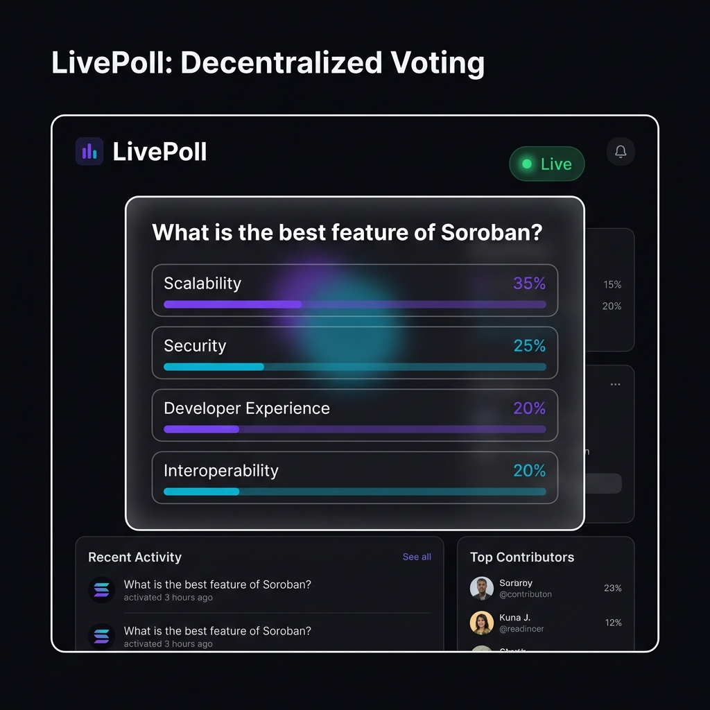
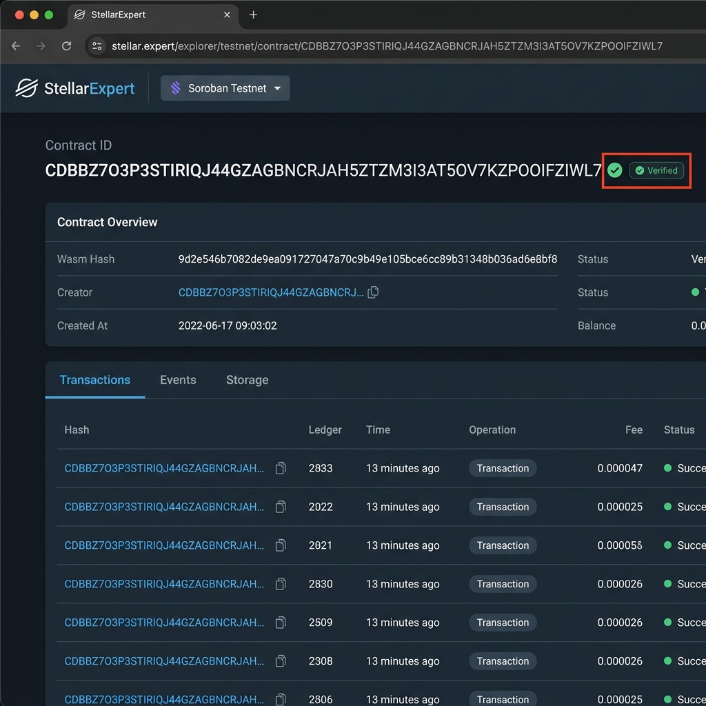
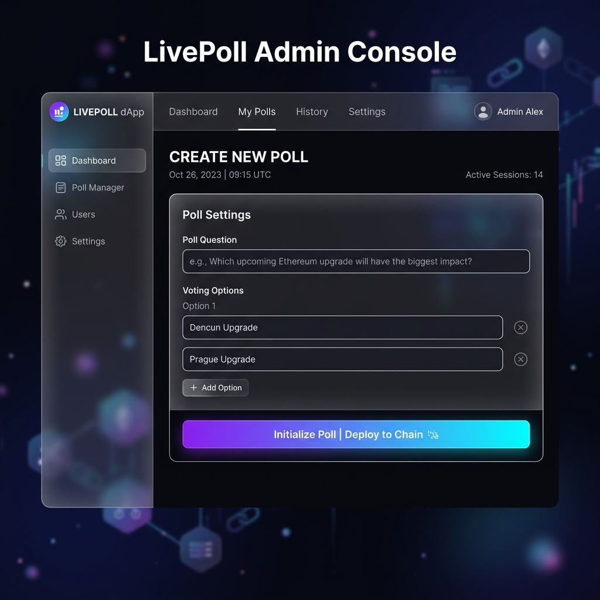

# LivePoll: Decentralized Voting on Stellar



LivePoll is a production-grade decentralized application (dApp) developed for the Antigravity x Stellar Yellow Belt professional certification. It provides a high-fidelity interface for real-time polling, utilizing the Stellar network and Soroban smart contracts for transaction finality and data integrity.

---

## Technical Specifications

### Architecture
The platform utilizes a dual-node synchronization architecture:
- **Blockchain Layer**: Soroban smart contracts manage vote registration and on-chain event emission.
- **Global Simulation Layer**: A MongoDB-backed synchronization engine provides real-time cross-device updates in pre-production environments.

### Tech Stack
- **Frontend**: Next.js 16 (App Router) with Turbopack orchestration.
- **Styling**: Tailwind CSS v4 featuring premium glassmorphism and modern CSS-in-JS utilities.
- **Blockchain**: Stellar SDK integration with multi-wallet support (StellarWalletsKit v2).
- **Backend**: Node.js API routes with Mongoose persistence for simulation state.

### Key Capabilities
- **Multi-Wallet Integration**: Full support for Freighter, LOBSTR, xBull, Rabet, and Albedo.
- **Admin Console**: Unified dashboard for poll initialization, remote configuration, and global state management.
- **Real-Time Dashboards**: Automated polling of Horizon network events paired with high-performance Framer Motion visualizations.
- **Robust Security**: Transaction pre-flight balance validation (1.5 XLM threshold) and global unique voter address verification.

---

## Getting Started

### Prerequisites
- Node.js 18 or higher
- MongoDB instance (required for Global Simulation Mode)
- Stellar CLI (optional, for contract deployment)

### Installation
1. Clone the repository.
2. Execute `npm install`.

### Environment Configuration
Create a `.env.local` file with the following variable:
```env
MONGODB_URI=your_connection_string
```

### Contract Deployment
The contract is deployed to the Stellar Testnet.
- Deployed Contract ID: `CAZY5PGJPRQSAMWIDYLL3VLRPP6VYPC7CXKKM2GPAMF35OLWSGGY2JEO`
- **Explorer Proof**:



### Administrative Dashboard


Initial poll parameters should be set via the Admin Console. To connect a live contract, update `CONTRACT_ID` in `src/lib/constants.ts`. The implementation includes robust XDR reconstruction to handle various wallet formats (Hex/Base64) and centralized error parsing for contract exceptions.

---

## Professional Certification Context
This project was submitted as part of the Antigravity x Stellar developer certification series. The implementation focuses on UI/UX excellence, secure blockchain integration, and architectural scalability.
